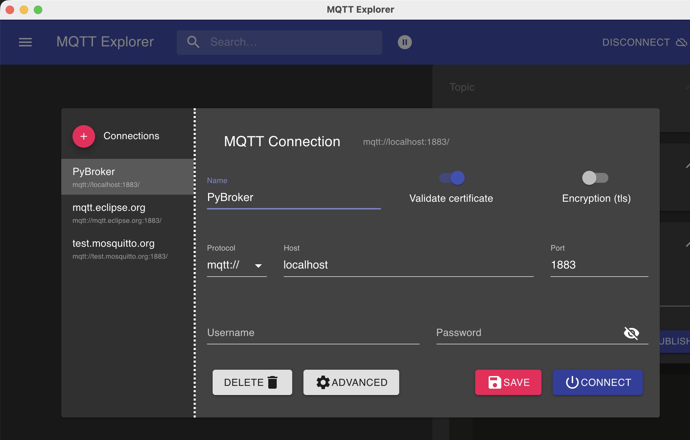
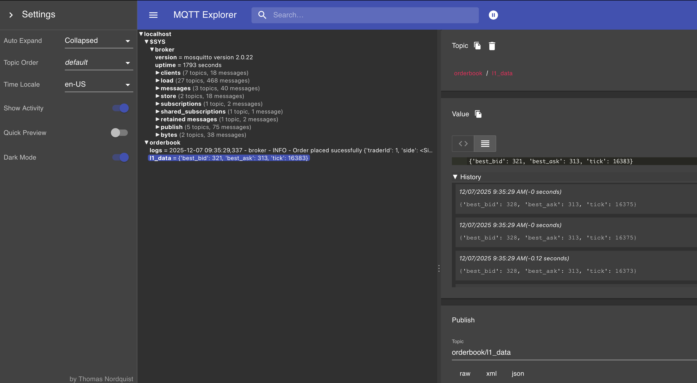

# Setup

- **Install requirements**

  `pip install -r requirements.txt`

- **Launch all services**

  `docker compose up` or `docker compose up --watch` for development

# Viewing order flow and logs with MQTT Explorer

https://mqtt-explorer.com/

# Running Tests

- **C++ tests (orderbook project)**: Requires `cmake` and a C++ toolchain.

  1. Ensure `cmake` is installed (macOS):

     `brew install cmake`

  2. Build and run tests from the `orderbook` folder:

     `cd orderbook && mkdir -p build && cd build && cmake .. && make`

     `ctest --output-on-failure`  # or run compiled test binary, e.g. `./test_orderbook`

# References

- https://www.fixtrading.org/standards/fix-4-4/
- https://github.com/eclipse-paho/paho.mqtt.cpp
